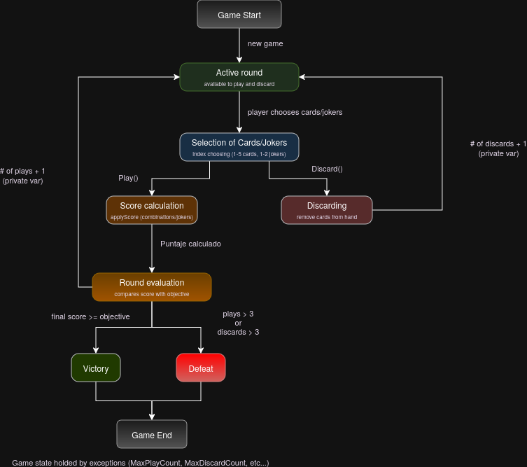

# Malatro – Tarea 2 (Entrega Final 2)

This document details the design decisions, code organization, and relevant notes for the
implementation described in the `EP4` and `EP6-EF2` statements.

---

## Table of contents

1. [Code organization](#1-code-organization)
2. [Relevant design decisions](#2-relevant-design-decisions)
3. [Design patterns used](#3-design-patterns-used)
4. [Testing organization](#4-testing-organization)
---

## 1. Code organization

```
src/main/scala/EF2/
├── Card.scala                   # Card class (rank + suit)
├── Score.scala                  # Score class (chips + multiplier)
├── combinations/
│   ├── Combination.scala        # Trait: contract for all combinations
│   ├── CombinationBase.scala    # Abstract class: shared validation logic
│   ├── straights/
│   │   ├── ApplyForStraights.scala   # Abstract: score dispatch for straights
│   │   ├── Straight.scala
│   │   └── StraightFlush.scala
│   └── otherCombinations/
│       ├── ColorFlush.scala
│       ├── HighCard.scala
│       ├── Pair.scala
│       └── Trio.scala
├── exceptions/
│   ├── MaxDiscardCountException.scala
│   └── MaxPlayCountException.scala
├── hand/
│   ├── Hand.scala               # Main hand class (play + discard logic)
│   ├── ListOps.scala            # Object: generic add/remove helpers
│   ├── ResolveHand.scala        # Resolves conflicting combinations by priority
│   └── ValidateAction.scala     # Abstract: validates play/discard preconditions
├── jokers/
│   ├── Joker.scala              # Trait: contract for all jokers
│   ├── JokerApply.scala         # Abstract class: default (no-op) joker behavior
│   ├── DeviousJoker.scala
│   ├── EvenJoker.scala
│   ├── GreedyJoker.scala
│   └── ScaryFace.scala
├── ranks/
│   ├── Rank.scala               # Trait: contract for all ranks
│   ├── ApplyForRank.scala       # Abstract class: default rank score dispatch
│   ├── evens/   (AllEven, Even object, Two, Four, Six, Eight, Ten)
│   ├── figures/ (AllFigure, Figure object, Jack, Queen, King)
│   └── odds/    (AllOdd, Odd object, Ace, Three, Five, Seven, Nine)
└── suits/
    ├── Suit.scala               # Trait: contract for all suits
    ├── applyForSuit.scala       # Abstract class: default suit score dispatch
    ├── Club.scala
    ├── Diamond.scala
    ├── Heart.scala
    └── Spades.scala
```

The general rule is: each distinguishable property of a card lives in its own package.
Every package contains a trait (the contract), one or more abstract classes (shared logic),
and the concrete classes. Sub-packages are created when concrete classes share enough
common behaviour to justify a further grouping (e.g. `straights` vs `otherCombinations`,
`evens` / `figures` / `odds` inside `ranks`).

`Score` and `Card` are the two exceptions: they do not implement any trait because they
are plain data/model classes that do not need polymorphic dispatch from the outside.

---

## 2. Relevant design decisions

### 2.1 Score calculation – double dispatch (EP4 & EP6-EF2)

Score calculation is the central design challenge of Tarea 2. The problem requires that
cards, combinations, suits, and ranks all interact with jokers in different ways, and that
**adding a new joker should never require touching existing card/rank/suit code**.

The solution is a **double-dispatch chain**:

```
Hand.play(indexes)
 └─ card.applyScore(score, jokers)        ← iterates each played card
     ├─ score.chips += rank.value         ← always happens first
     ├─ rank.applyScore(score, j)         ← dispatches to joker via rank type
     │    └─ j.applyEvenRank(score)  (or j.applyOddRank / j.applyFigureRank)
     └─ suit.applyScore(score, j)         ← dispatches to joker via suit type
          └─ j.applyDiamond(score)   (or j.applyOtherSuit)
 └─ combination.applyScore(score, j)     ← iterates each active joker
      └─ j.applyStraight(score)      (or j.applyOtherCombination)
```

Each concrete rank/suit/combination type calls the *matching* method on the joker. Each
concrete joker overrides only the methods it cares about; `JokerApply` provides no-op
defaults for everything else. This means:

- Adding a new joker = create a new class extending `JokerApply` and override relevant methods.
- Adding a new suit/rank = create a new class and call the right joker method.
- No `match`/`if-instanceof` chains anywhere.

### 2.2 Combination validation – `CombinationBase` and `ResolveHand`

Code duplication appeared early in the combination classes because many validation methods
share the same helper logic (`sameSuit`, `isStraight`, `sameRange`). These were extracted
into `CombinationBase`, which all concrete combination classes extend.

Conflict resolution (e.g. a hand that is simultaneously a `StraightFlush`, a `ColorFlush`,
and a `Straight`) is handled by `ResolveHand`. It instantiates every combination type once
and checks them in priority order:

```
StraightFlush > ColorFlush > Straight > Trio > Pair > HighCard
```

The downside of this approach is that `ResolveHand` must be used to resolve ambiguous
hands — the individual `validate()` methods remain useful for single-combination checks
(e.g. in tests) but do not encode priority.

### 2.3 Straight combinations – `ApplyForStraights`

`DeviousJoker` only triggers on straights. To route the dispatch correctly without a
`match` on combination type, `StraightFlush` and `Straight` both extend `ApplyForStraights`,
which overrides `applyScore` to call `j.applyStraight(score)` instead of
`j.applyOtherCombination(score)`. All other combinations inherit the default from
`CombinationBase`.

### 2.4 Hand – `ListOps` and mutable lists

Two sources of duplication inside `Hand` were:

1. Adding/removing cards and jokers used identical index-checking logic → extracted to
   the `ListOps` object with generic methods `addElem[T]` / `removeElem[T]`.
2. An abstract class was *not* used here because only a single file had the duplication;
   a Scala `object` is lighter and sufficient.

Mutable `List` fields were chosen over immutable ones because the game model updates the
hand state in place (cards are physically removed after playing or discarding). Keeping a
history of every past hand state has no use case in Balatro's rules and would waste memory.

### 2.5 Exception handling (EP4)

All exceptions required by EP4 are implemented:

| Condition                       | Exception / mechanism                                    |
|---------------------------------|----------------------------------------------------------|
| Hand > 8 cards                  | `IllegalArgumentException` in `addCard`                  |
| Hand > 2 jokers                 | `IllegalArgumentException` in `addJoker`                 |
| Remove card at invalid index    | `IndexOutOfBoundsException` in `ListOps.removeElem`      |
| Remove joker at invalid index   | `IndexOutOfBoundsException` in `ListOps.removeElem`      |
| Play > 3 times                  | `MaxPlayCountException` in `Hand.play`                   |
| Discard > 3 times               | `MaxDiscardCountException` in `Hand.discard`             |
| Play/discard > 5 cards          | `IllegalArgumentException` in `ValidateAction.validate`  |
| Play/discard < 1 card           | `IllegalArgumentException` in `ValidateAction.validate`  |
| Play/discard invalid index list | `IndexOutOfBoundsException` in `ValidateAction.validate` |

### 2.6 Rank classification

Rank classification (`Even`, `Odd`, `Figure`) is represented as a Scala `object` rather
than a sealed trait hierarchy. This is intentionally simple: a `String` or an `object`
carry the same information here, and `object` gives referential equality for free
(`rank.classification == Even`). A full trait hierarchy would add files and indirection
without benefit given that the classification is only used for dispatch (which already
goes through the joker double-dispatch chain) and for testing.

---

## 3. Design patterns used

| Pattern                             | Where                                                                             |
|-------------------------------------|-----------------------------------------------------------------------------------|
| **Trait as contract**               | `Rank`, `Suit`, `Joker`, `Combination`                                            |
| **Abstract class for shared logic** | `CombinationBase`, `JokerApply`, `AllEven`, `AllOdd`, `AllFigure`, `applyForSuit` |
| **Double dispatch**                 | `Rank/Suit.applyScore` → `Joker.applyXxx`                                         |
| **Template method**                 | `ApplyForStraights.applyScore` overrides the dispatch target                      |
| **Composition**                     | `ResolveHand` holds instances of every combination type                           |
| **Utility object**                  | `ListOps` – generic helpers, no state                                             |

---

## 4. Testing organization

Tests live under `src/test/scala`:

| File               | What it covers                                                                                                                            |
|--------------------|-------------------------------------------------------------------------------------------------------------------------------------------|
| `ScoreTest`        | Construction, getters, setters, comparisons of `Score`                                                                                    |
| `RankTest`         | Construction, equality, `applyScore` interactions per rank class                                                                          |
| `SuitTest`         | Construction, equality, `applyScore` interactions per suit class                                                                          |
| `CardTest`         | Construction, equality, getter delegation                                                                                                 |
| `JokerTest`        | Each joker's effect on score through `Card.applyScore` and `Combination.applyScore`; interaction accumulation                             |
| `CombinationsTest` | Validation of every combination type, edge cases (ace duality, conflict resolution)                                                       |
| `HandTest`         | `addCard`/`addJoker`, `removeCard`/`removeJoker`, `play`, `discard`; all exception paths; full scoring example from the project statement |


## Game State Diagram:




